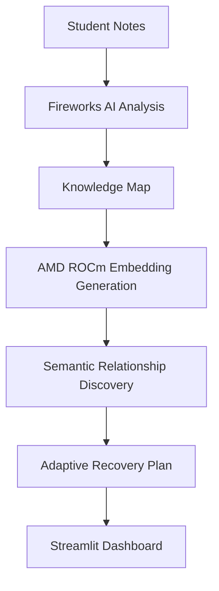

# Rebound


## Live Demo

- **Live Application:** https://rebound-amd.streamlit.app/
- **GitHub Repository:** https://github.com/cyeeezz/rebound-amd

Rebound is an AI-powered adaptive exam-recovery study planner that turns a
student's revision notes into a prerequisite-aware, self-adjusting study plan.

**At a glance:**

- Adaptive exam recovery planning
- AI-powered topic analysis
- Knowledge graph visualization
- AMD ROCm semantic embedding generation
- Fireworks AI reasoning
- Live Streamlit application

---

## Overview

A student uploads revision notes; Rebound extracts the topic structure, runs a
diagnostic, estimates mastery, and builds a day-by-day plan that re-plans itself
when sessions are missed. It runs on **two independent AI runtimes**:

- **AMD Radeon GPU (PyTorch ROCm)** generates semantic topic embeddings and
  discovers topic-to-topic relationships, exported as artifacts the app loads at
  runtime.
- **Fireworks AI** performs the language reasoning — extracting topics from notes
  and generating diagnostic exam questions.

**Why it's technically innovative:** most projects use a GPU once to prove a
number. Rebound turns AMD GPU output into a *durable product feature* — the
deployed app reads the AMD-generated embeddings on every run and surfaces a
**Verified AMD GPU Execution** panel that appears only when the run manifest
proves a real, completed GPU execution. The two runtimes are cleanly separated
and independently verifiable.

## Architecture



Full technical reference: **[docs/AMD_EXECUTION.md](docs/AMD_EXECUTION.md)**.

## Features

- Adaptive planning that re-prioritises as mastery, available time, and schedule change.
- Fireworks AI topic/concept extraction from uploaded notes.
- Verified AMD GPU execution surfaced in-app.
- Diagnostic assessment with keyword/semantic marking.
- Knowledge map combining a prerequisite graph with AMD-computed semantic similarity.
- Recovery preview before applying missed-day changes.
- Privacy controls: explicit upload consent and one-click "Clear data".

## AMD GPU Execution Evidence

Every stage of AMD ROCm execution is captured in
[`docs/amd-evidence/`](docs/amd-evidence/). All values below come directly from
the final notebook run and the committed artifacts.

### 1. AMD ROCm environment


`rocm-smi` confirms an AMD GPU is physically present and the ROCm stack is active
— the workload ran on real AMD hardware, not a CPU or a simulated device.

### 2. PyTorch ROCm


PyTorch (`2.9.1`, ROCm/HIP `7.2.53211-e1a6bc5663`) detects the GPU:
`gpu_available = true`, `gpu_count = 1`, device `AMD ROCm device 0`. GPU detection
happens through the framework itself, so the tensors that follow execute on the
AMD device.

### 3. SentenceTransformer


`sentence-transformers/all-MiniLM-L6-v2` loads and is placed on the ROCm device —
the embedding model executes on the AMD GPU.

### 4. Embedding generation


Each topic is encoded into a dense vector on the GPU:

- **Embedding shape:** `(7, 384)`
- **Embedding dimensions:** `384`
- **Topic count:** `7`

### 5. Semantic relationship generation


Pairwise **cosine similarity** across the topic embeddings captures conceptual
closeness independent of magnitude. Pairs at or above the semantic threshold
(`0.3`) become relationships — **21 semantic relationships were generated.**

### 6. Artifact generation


The run writes three artifacts to `amd_artifacts/`:

- `embeddings.npy` — float32 embedding matrix `(7, 384)`
- `topic_metadata.json` — per-topic summaries + semantic relationships
- `amd_run_manifest.json` — run provenance

### 7. Manifest


The provenance manifest records the device (`AMD ROCm device 0`), ROCm/HIP
(`7.2.53211-e1a6bc5663`), model (`all-MiniLM-L6-v2`), execution time
(`0.010224 s`), and relationship count (`21`).

### 8. Artifact verification


All three artifacts exist with the expected sizes: `embeddings.npy` 10,880 B,
`topic_metadata.json` 10,781 B, `amd_run_manifest.json` 931 B.

### 9. SHA-256 verification


Integrity is verifiable via `sha256sum` — the artifacts in the repo are exactly
those produced by the GPU run:

```
b802d42b539dfdeb39947b39d989015090a2abe315e1dbd501842ac7ecccdf87  embeddings.npy
f022602769aae1108cb7f6fe2b02178ab87d46063840d7304d04a2e71cdee1e7  topic_metadata.json
0bc6fd9013beefaedc4b530a1764fb80ab7edcfe2953acaf93f1bdabde778557  amd_run_manifest.json
```

### 10. Production application


The Streamlit app loads these artifacts at runtime through `utils/amd_loader.py`
and renders the **Verified AMD GPU Execution** panel — only when
`is_verified_amd_run()` confirms a real, completed GPU run. Because the deployed
app consumes the AMD-generated artifacts on every launch, **AMD compute is an
integral part of the production pipeline, not just a benchmark.**

## Why AMD Matters

- **AMD accelerates semantic embedding generation** on Radeon hardware via PyTorch ROCm.
- **Embeddings become permanent application assets** — exported once, committed, and consumed on every run.
- **Fireworks handles language reasoning separately** — a distinct runtime that never overlaps with AMD compute.
- **The deployed app directly consumes the AMD artifacts** — the Knowledge Map's semantic edges and the Verified AMD GPU Execution panel are both AMD-driven. Remove the artifacts and the semantic-intelligence features disappear.

## Artifacts

| File | Description |
|------|-------------|
| `amd_artifacts/embeddings.npy` | Float32 topic embedding matrix `(7, 384)`. Loaded with `allow_pickle=False`. |
| `amd_artifacts/topic_metadata.json` | Per-topic titles, summaries, key concepts, semantic relationships. |
| `amd_artifacts/amd_run_manifest.json` | Run provenance: status, GPU, ROCm/HIP + PyTorch versions, model, counts, timestamp, duration. |

`utils/amd_loader.py` exposes `load_amd_manifest()`, `load_amd_metadata()`,
`load_amd_embeddings()`, `get_semantic_relationships()`, and
`is_verified_amd_run()`, each degrading gracefully when an artifact is missing.

## Installation

```bash
git clone https://github.com/cyeeezz/rebound-amd.git
cd rebound-amd

python -m venv .venv
# Windows:  .venv\Scripts\activate
# macOS/Linux:  source .venv/bin/activate

pip install -r requirements.txt
```

## Usage

```bash
streamlit run app.py
```

`.streamlit/config.toml` sets a 25 MB upload cap and enables XSRF protection. The
AMD notebook is run separately on ROCm hardware to (re)generate artifacts.

**Environment variables:**

| Variable | Purpose |
|----------|---------|
| `FIREWORKS_API_KEY` | **Required.** Read from `.streamlit/secrets.toml` first, then the environment. Never hardcoded. |
| `DEBUG_OFFLINE` | Optional. Set to `1` to force local analysis/question generation offline. |

Store the key in `.streamlit/secrets.toml` (git-ignored):

```toml
FIREWORKS_API_KEY = "fw-..."
```

## Try Rebound with the Sample File

Don't have your own notes? Download the sample A-Level Biology PDF and upload it
to the [live application](https://rebound-amd.streamlit.app/) to reproduce the
demonstrated biology workflow end to end. The file covers the same seven topics
used to build the AMD artifacts, so the diagnostic, plan, and knowledge map all
populate as shown.

- Sample file: [sample-a-level-biology-notes.pdf](sample-data/sample-a-level-biology-notes.pdf)
- Full testing instructions: [sample-data/README.md](sample-data/README.md)

## Repository Structure

```text
rebound-amd/
├── app.py                    # Streamlit application (UI + planning logic)
├── ui/                       # Design system: components, theme, icons, logo
├── utils/
│   └── amd_loader.py         # Loads & verifies AMD artifacts at runtime
├── amd_artifacts/            # AMD ROCm outputs: embeddings, metadata, manifest
├── notebooks/
│   └── rebound_amd_embeddings.ipynb   # AMD ROCm embedding notebook
├── knowledge_map.json        # Extracted topic graph (notebook input)
├── docs/
│   ├── AMD_EXECUTION.md       # AMD technical reference
│   ├── GITHUB_ABOUT.md        # Suggested GitHub About metadata
│   └── amd-evidence/          # Execution screenshots 01–10 + supplementary/
├── sample-data/
│   ├── README.md              # Sample-file testing instructions
│   └── sample-a-level-biology-notes.pdf   # Demo A-Level Biology notes (10 pages)
├── requirements.txt
├── .streamlit/config.toml    # Upload cap + XSRF protection
├── .gitattributes
├── LICENSE
└── README.md
```

## Security

- No hardcoded secrets; `.streamlit/secrets.toml` is git-ignored.
- Safe deserialisation: stdlib JSON; numpy `allow_pickle=False`; no pickle/eval/exec.
- All dynamic values rendered via `unsafe_allow_html` pass through `html.escape`.
- Uploads bounded to 25 MB; generic user-facing errors; internal exceptions logged server-side only.
- Explicit upload consent before analysis, and "Clear data" wipes session state.

## Target Users

Rebound is built for learners who need to recover ground quickly before an exam:

- University students juggling several modules at once.
- College students revising dense, interconnected material.
- Any learner preparing for a high-stakes exam.
- Students who have **fallen behind** and need a realistic path back on track.

## Problem

Revision breaks down in predictable ways:

- **Poor revision planning** — students don't know what to study first or how to sequence topics.
- **Forgotten prerequisite concepts** — later topics fail because the foundations underneath them were never solid.
- **Limited revision time** — deadlines compress, and every missed day cascades into the rest of the schedule.
- **Generic AI study assistants** — chatbots answer questions but don't build a structured, prerequisite-aware recovery plan.

## Solution

Rebound turns a student's own material into a personalised recovery plan:

- **Uploaded notes** become the single source of truth for the plan.
- **AI analysis** (Fireworks) extracts topics, concepts, and learning objectives.
- **A knowledge graph** maps how topics connect — prerequisites plus AMD-computed semantic relationships.
- **Prerequisite recovery** prioritises the foundational topics that unlock everything else.
- **An adaptive study plan** re-sequences itself around mastery, available time, and missed sessions, with a preview before changes are applied.

## Market Opportunity

- **EdTech is growing fast**, with sustained demand for tools that improve study outcomes.
- **AI-assisted education** is moving from novelty to expectation among students.
- **Personalized learning** — plans built around an individual's own notes and gaps — is where the strongest demand is heading.

## Competitive Advantage

- **AMD-generated semantic embeddings** — real GPU-computed topic relationships, not hand-written rules.
- **Prerequisite-aware recovery** — the plan understands topic dependencies, not just a flat to-do list.
- **Explainable knowledge relationships** — every semantic edge is visible and traceable in the Knowledge Map.
- **Fireworks AI adaptive reasoning** — high-quality extraction and diagnostics driving the plan.

## Revenue Opportunities

- **Freemium student plan** — core planning free; advanced features paid.
- **Premium AI coaching** — deeper diagnostics, richer feedback, and tighter recovery loops.
- **University licensing** — institution-wide access for departments and faculties.
- **School subscriptions** — seat-based plans for secondary schools and colleges.
- **API integration** — expose the knowledge-graph and planning engine to partners.

## Future Roadmap

- **Live AMD inference** — move embedding generation into a hosted ROCm service.
- **Teacher dashboard** — cohort visibility into progress and weak spots.
- **LMS integration** — connect with Canvas, Moodle, and similar platforms.
- **Mobile application** — study and re-plan on the go.
- **Collaborative study groups** — shared plans and peer accountability.
- **More subject domains** — expand beyond the initial subject coverage.

## Hackathon Evidence

- **Notebook:** `notebooks/rebound_amd_embeddings.ipynb` (AMD Radeon Developer Cloud, PyTorch ROCm).
- **Verified manifest:** `amd_artifacts/amd_run_manifest.json` — `execution_status: completed`, `gpu_available: true`, ROCm/HIP + PyTorch recorded, `topic_count: 7`, `embedding_dimensions: 384`, `relationship_count: 21`.
- **Step-by-step screenshots:** [`docs/amd-evidence/`](docs/amd-evidence/).
- **Technical reference:** [`docs/AMD_EXECUTION.md`](docs/AMD_EXECUTION.md).

## License

Released under the **MIT License** — see [`LICENSE`](LICENSE).
