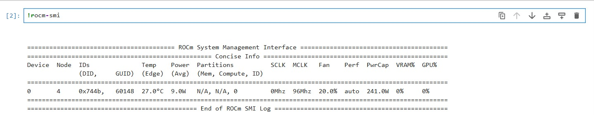
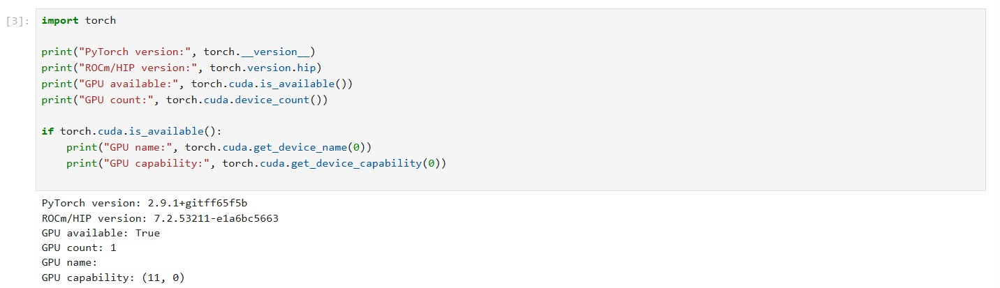
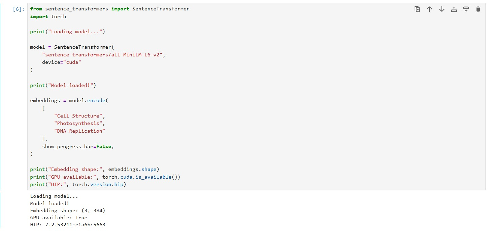
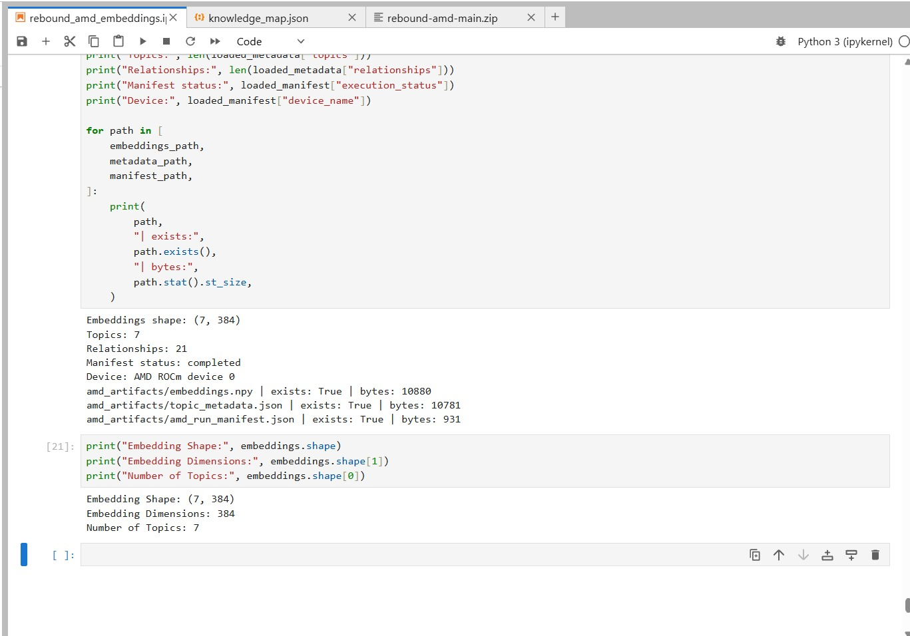
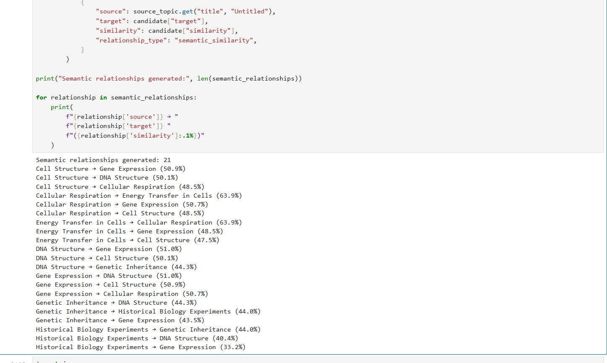
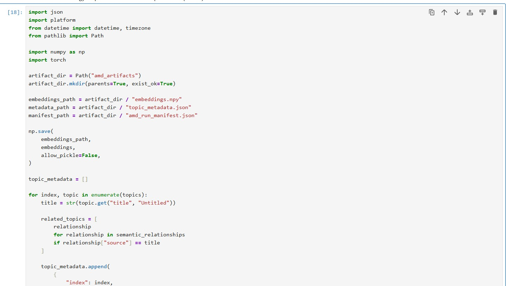
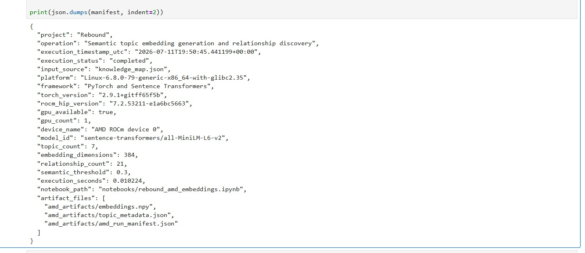
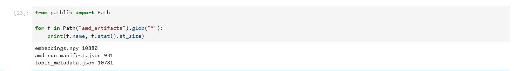
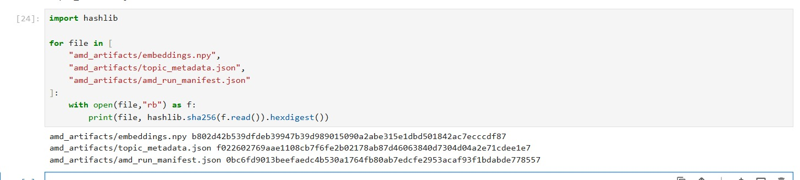

# Rebound


**Rebound is an AI-powered adaptive exam-recovery study planner.** A student
uploads revision notes; Rebound extracts the topic structure, runs a diagnostic,
estimates mastery, and builds a day-by-day plan that re-plans itself when
sessions are missed.

It is built on **two independent AI runtimes**:

- **AMD Radeon GPU (PyTorch ROCm)** generates semantic topic embeddings and
  discovers topic-to-topic relationships. These are exported as artifacts and
  loaded by the app at runtime — **AMD compute is a permanent production asset,
  not a benchmark.**
- **Fireworks AI** performs the natural-language reasoning: extracting topics
  from notes and generating diagnostic exam questions.

**Why it's technically innovative:** most projects use a GPU once to prove a
number. Rebound turns AMD GPU output into a *durable product feature* — the
deployed Streamlit app reads the AMD-generated embeddings on every run and
surfaces a **Verified AMD GPU Execution** panel that only appears when the run
manifest proves a real, completed GPU execution. Language reasoning (Fireworks)
and semantic compute (AMD) are cleanly separated and independently verifiable.

---

## How it works

```
User upload ─▶ Fireworks AI extraction ─▶ Knowledge Map
                                              ▲
                        AMD GPU Notebook ─────┘
                        (ROCm + SentenceTransformer)
                        → embeddings → cosine similarity
                        → semantic relationships → artifacts
```

Full technical reference: **[docs/AMD_EXECUTION.md](docs/AMD_EXECUTION.md)**.

---

## AMD GPU Evidence

Every stage of AMD ROCm execution is captured in
[`docs/amd-evidence/`](docs/amd-evidence/). All values below come directly from
the notebook run and the committed artifacts.

### 1. AMD ROCm environment



`rocm-smi` output confirms an AMD GPU is physically present and the ROCm stack
is active in the runtime. This proves the workload ran on real AMD hardware, not
a CPU or a simulated device.

### 2. PyTorch ROCm



PyTorch (`2.9.1`, ROCm/HIP `7.2.53211-e1a6bc5663`) detects the GPU:
`gpu_available = true`, `gpu_count = 1`, device `AMD ROCm device 0`. This is GPU
detection through the framework itself — the tensors that follow execute on the
AMD device.

### 3. SentenceTransformer



The `sentence-transformers/all-MiniLM-L6-v2` model loads and is placed on the
ROCm device. The embedding model is executing **on the AMD GPU**, not on CPU.

### 4. Embedding generation



Each topic is encoded into a dense vector on the GPU:

- **Embedding shape:** `(7, 384)`
- **Embedding dimensions:** `384`
- **Topic count:** `7`

### 5. Semantic relationship generation



Pairwise **cosine similarity** is computed across all topic embeddings — the
cosine of the angle between two vectors, which captures conceptual closeness
independent of magnitude. Pairs at or above the semantic threshold (`0.3`) are
recorded as relationships. **21 semantic relationships were generated.**

### 6. Artifact generation



The run writes three artifacts to `amd_artifacts/`:

- `embeddings.npy` — float32 embedding matrix `(7, 384)`
- `topic_metadata.json` — per-topic summaries + semantic relationships
- `amd_run_manifest.json` — run provenance

### 7. Manifest



The provenance manifest records:

- **Device:** `AMD ROCm device 0`
- **ROCm/HIP:** `7.2.53211-e1a6bc5663`
- **Model:** `sentence-transformers/all-MiniLM-L6-v2`
- **Execution time:** `0.010224 s`
- **Relationship count:** `21`

### 8. Artifact verification



All three artifacts exist with expected sizes:

- `embeddings.npy` — 10,880 B
- `topic_metadata.json` — 10,781 B
- `amd_run_manifest.json` — 931 B

### 9. SHA-256 verification



Integrity is verifiable via `sha256sum` — the artifacts in the repo are exactly
those produced by the GPU run:

```
b802d42b539dfdeb39947b39d989015090a2abe315e1dbd501842ac7ecccdf87  embeddings.npy
f022602769aae1108cb7f6fe2b02178ab87d46063840d7304d04a2e71cdee1e7  topic_metadata.json
0bc6fd9013beefaedc4b530a1764fb80ab7edcfe2953acaf93f1bdabde778557  amd_run_manifest.json
```

### 10. Production application


The Streamlit app loads these artifacts at runtime through
`utils/amd_loader.py` and renders the **Verified AMD GPU Execution** panel — only
when `is_verified_amd_run()` confirms a real, completed GPU run. Because the
deployed app consumes the AMD-generated artifacts on every launch, **AMD compute
is an integral part of the production pipeline, not just a benchmark.**

---

## Why AMD Matters

- **AMD GPU accelerates semantic embedding generation** — the SentenceTransformer
  encodes topics on AMD Radeon hardware via PyTorch ROCm.
- **Generated embeddings become permanent application assets** — exported once,
  committed to the repo, and consumed by the app on every run.
- **Fireworks performs language reasoning separately** — topic extraction and
  question generation are a distinct runtime; the two never overlap.
- **The deployed application directly consumes the AMD-generated artifacts** —
  the Knowledge Map's semantic relationships and the Verified AMD GPU Execution
  panel are both driven by the AMD run.
- **AMD compute is an integral part of the production pipeline** — remove the
  AMD artifacts and the semantic-intelligence features are gone. This is
  production GPU usage, not a throwaway demo.

---

## Features

- Adaptive planning that re-prioritises as mastery, time, and schedule change.
- Fireworks AI topic/concept extraction from uploaded notes.
- Verified AMD GPU execution surfaced in-app.
- Diagnostic assessment with keyword/semantic marking.
- Knowledge map with prerequisite graph **plus** AMD-computed semantic similarity.
- Recovery preview before applying missed-day changes.
- Privacy controls: explicit upload consent and one-click "Clear data".

## Artifacts

| File | Description |
|------|-------------|
| `amd_artifacts/embeddings.npy` | Float32 topic embedding matrix `(7, 384)`. Loaded with `allow_pickle=False`. |
| `amd_artifacts/topic_metadata.json` | Per-topic titles, summaries, key concepts, semantic relationships. |
| `amd_artifacts/amd_run_manifest.json` | Run provenance: status, GPU, ROCm/HIP + PyTorch versions, model, counts, timestamp, duration. |

`utils/amd_loader.py` exposes `load_amd_manifest()`, `load_amd_metadata()`,
`load_amd_embeddings()`, `get_semantic_relationships()`, and
`is_verified_amd_run()`, each degrading gracefully when an artifact is missing.

## Installation

```bash
git clone https://github.com/cyeeezz/rebound-amd.git
cd rebound-amd

python -m venv .venv
# Windows:  .venv\Scripts\activate
# macOS/Linux:  source .venv/bin/activate

pip install -r requirements.txt
```

## Running

```bash
streamlit run app.py
```

`.streamlit/config.toml` sets a 25 MB upload cap and enables XSRF protection. The
AMD notebook is run separately on ROCm hardware to (re)generate artifacts.

## Environment variables

| Variable | Purpose |
|----------|---------|
| `FIREWORKS_API_KEY` | **Required.** Read from `.streamlit/secrets.toml` first, then the environment. Never hardcoded. |
| `DEBUG_OFFLINE` | Optional. Set to `1` to force local analysis/question generation offline. |

Store the key in `.streamlit/secrets.toml` (git-ignored):

```toml
FIREWORKS_API_KEY = "fw-..."
```

## Security

- No hardcoded secrets; `.streamlit/secrets.toml` is git-ignored.
- Safe deserialisation: stdlib JSON; numpy `allow_pickle=False`; no pickle/eval/exec.
- All dynamic values rendered via `unsafe_allow_html` pass through `html.escape`.
- Uploads bounded to 25 MB; generic user-facing errors; internal exceptions logged server-side only.
- Explicit upload consent before analysis, and "Clear data" wipes session state.

## Hackathon evidence

- **Notebook:** `notebooks/rebound_amd_embeddings.ipynb` (AMD Radeon Developer
  Cloud, PyTorch ROCm).
- **Verified manifest:** `amd_artifacts/amd_run_manifest.json` —
  `execution_status: completed`, `gpu_available: true`, ROCm/HIP + PyTorch
  recorded, `topic_count: 7`, `embedding_dimensions: 384`,
  `relationship_count: 21`.
- **Step-by-step screenshots:** [`docs/amd-evidence/`](docs/amd-evidence/).
- **Technical reference:** [`docs/AMD_EXECUTION.md`](docs/AMD_EXECUTION.md).

## License

Released under the **MIT License** — see [`LICENSE`](LICENSE).
