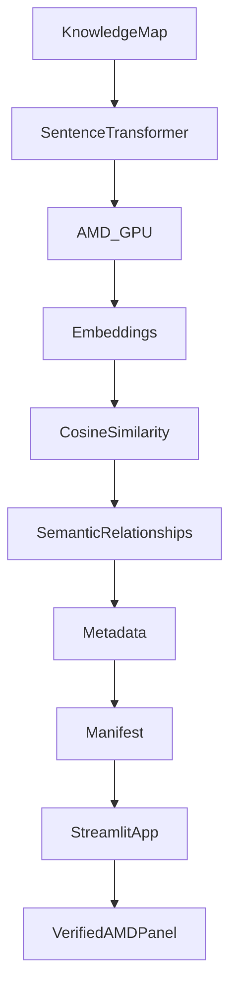

# AMD GPU Execution — Technical Reference

How Rebound uses AMD Radeon GPU hardware (ROCm + PyTorch) to generate the
semantic embeddings and topic relationships that the production Streamlit
application consumes. Every value and screenshot below comes directly from the
final notebook run (7 topics, 384 dimensions, 21 relationships) and the
generated artifacts — nothing is reconstructed.

## Architecture



## Notebook workflow

`notebooks/rebound_amd_embeddings.ipynb`, executed in the AMD Radeon Developer
Cloud, performs, in order: verify ROCm → load `knowledge_map.json` → load the
SentenceTransformer on the GPU → encode topics → compute cosine similarity →
discover relationships → write artifacts + provenance manifest.

## ROCm GPU execution


`rocm-smi` confirms a physical AMD GPU (Device 0) and an active ROCm stack in the
runtime — the workload runs on real AMD hardware, not CPU.

## PyTorch HIP runtime


PyTorch detects the GPU through the HIP runtime: `torch.cuda.is_available() = True`,
`GPU count = 1`, PyTorch `2.9.1+gitff65f5b`, ROCm/HIP `7.2.53211-e1a6bc5663`.

| Property | Value (from `amd_run_manifest.json`) |
|----------|--------------------------------------|
| GPU available | `true` |
| GPU count | `1` |
| Device | `AMD ROCm device 0` |
| ROCm / HIP version | `7.2.53211-e1a6bc5663` |
| PyTorch version | `2.9.1+gitff65f5b` (ROCm build) |
| Platform | `Linux-6.8.0-79-generic-x86_64-with-glibc2.35` |

## SentenceTransformer inference


`sentence-transformers/all-MiniLM-L6-v2` loads and is placed on the ROCm device
(`device="cuda"` maps to HIP). The model executes on the AMD GPU, encoding text
into 384-dimensional vectors.

## Embedding generation


The final run encodes all knowledge-map topics on the GPU:

- **Embedding shape:** `(7, 384)`
- **Embedding dimensions:** `384`
- **Topic count:** `7`

## Cosine similarity

Pairwise **cosine similarity** is computed across the topic embeddings — the
cosine of the angle between two vectors, capturing conceptual closeness
independent of magnitude. Pairs at or above the semantic threshold (`0.3`) are
kept (see the cosine-similarity cell in
[`amd-evidence/supplementary/`](amd-evidence/supplementary/)).

## Semantic relationship discovery


**21 semantic relationships generated** (`relationship_count: 21`). These are
conceptual-similarity edges — additive to, and never a replacement for, the
prerequisite graph used for study planning.

## Artifact generation


The run writes three artifacts to `amd_artifacts/`:
`embeddings.npy` (via `np.save(..., allow_pickle=False)`), `topic_metadata.json`,
and `amd_run_manifest.json`.

## Manifest generation


The provenance manifest records the full run context:

| Field | Value |
|-------|-------|
| operation | Semantic topic embedding generation and relationship discovery |
| execution_status | `completed` |
| execution_timestamp_utc | `2026-07-11T19:50:45.441199+00:00` |
| execution_seconds | `0.010224` |
| input_source | `knowledge_map.json` |
| device_name | `AMD ROCm device 0` |
| model_id | `sentence-transformers/all-MiniLM-L6-v2` |
| topic_count | `7` |
| embedding_dimensions | `384` |
| relationship_count | `21` |

## Artifact validation


All three artifacts exist with the expected sizes:

| File | Size |
|------|------|
| `embeddings.npy` | 10,880 B |
| `topic_metadata.json` | 10,781 B |
| `amd_run_manifest.json` | 931 B |

## SHA-256 verification


Cryptographic integrity of the committed artifacts:

| File | SHA-256 |
|------|---------|
| `embeddings.npy` | `b802d42b539dfdeb39947b39d989015090a2abe315e1dbd501842ac7ecccdf87` |
| `topic_metadata.json` | `f022602769aae1108cb7f6fe2b02178ab87d46063840d7304d04a2e71cdee1e7` |
| `amd_run_manifest.json` | `0bc6fd9013beefaedc4b530a1764fb80ab7edcfe2953acaf93f1bdabde778557` |

```bash
sha256sum amd_artifacts/embeddings.npy \
          amd_artifacts/topic_metadata.json \
          amd_artifacts/amd_run_manifest.json
```

> The JSON artifacts must be checked out with LF line endings (enforced by
> `.gitattributes`) for these hashes to reproduce.

## Integration into the deployed Streamlit application


At runtime, `utils/amd_loader.py` loads the three artifacts defensively (safe
JSON parsing; `numpy.load(..., allow_pickle=False)`; graceful fallback). The app
renders the **Verified AMD GPU Execution** panel on the About page — shown only
when `is_verified_amd_run()` confirms a real, completed GPU run — and the **AMD
Semantic Relationships** section on the Knowledge Map. Because the deployed app
reads these AMD-generated artifacts on every launch, AMD compute is part of the
production pipeline, not a one-off benchmark. Fireworks AI handles language
reasoning as a separate runtime and never runs inside the AMD notebook.
